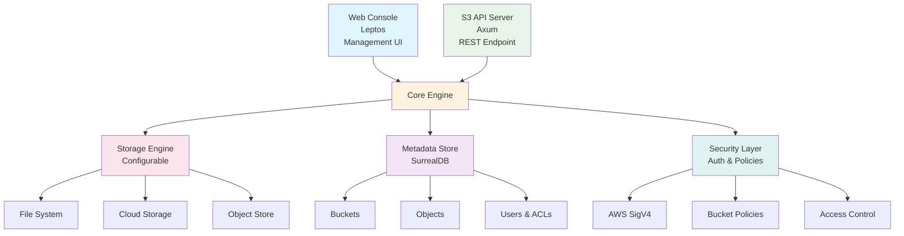

<div align="left">
  
</div>

# ObjectIO - S3-Compatible Object Storage

[](https://opensource.org/licenses/MIT)
[](https://www.rust-lang.org)
[](https://www.docker.com)

ObjectIO is a high-performance, self-hosted S3-compatible object storage system built in Rust. It provides enterprise-grade features with AWS S3 API compatibility, designed for modern cloud-native applications.

## 🚀 Features

- **S3 API Compatibility**: Full AWS S3 API compatibility for seamless migration
- **High Performance**: Built with Rust and async/await for maximum throughput
- **Enterprise Security**: AWS Signature Version 4, RBAC, audit logging
- **Scalable Architecture**: Modular design with pluggable storage backends
- **Modern Stack**: Axum web framework, SurrealDB, Redis caching
- **Cloud Native**: Docker-ready with comprehensive observability
- **Object Versioning**: Full object versioning support
- **Multipart Uploads**: Support for large file uploads
- **Web Console**: Separate web interface for management (see [ObjectIO Console](https://github.com/object-io/object-io-console))

## 🏗️ Architecture

ObjectIO is designed as a modular system with the following components:

**Backend Repository (this repo)**: Core S3-compatible server  
**Console Repository**: [ObjectIO Console](https://github.com/object-io/object-io-console) - Web management interface



### Core Components

- **`object-io-core`**: Shared types, utilities, and business logic
- **`object-io-api`**: S3-compatible REST API implementation
- **`object-io-storage`**: Pluggable storage backend abstraction
- **`object-io-metadata`**: Metadata management and SurrealDB integration
- **`object-io-server`**: Main server binary and configuration

### Related Repositories

- **[ObjectIO Console](https://github.com/object-io/object-io-console)**: Web-based management interface built with Leptos WebAssembly

## 🛠️ Quick Start

### Prerequisites

- **Rust** 1.75+ (latest stable recommended)
- **SurrealDB** 1.1+
- **Node.js** 18+ (for frontend development)
- **Docker** (optional, for containerized deployment)

### Development Setup

1. **Clone the repository**:

   ```bash
   git clone https://github.com/object-io/object-io.git
   cd object-io
   ```

2. **Install dependencies**:

   ```bash
   # Install Rust dependencies
   cargo build
   ```

3. **Start SurrealDB**:

   ```bash
   surreal start --log trace --user root --pass root file://objectio.db
   ```

4. **Configure environment**:

   ```bash
   cp .env.example .env
   # Edit .env with your configuration
   ```

5. **Run the development server**:

   ```bash
   cargo run --bin object-io-server
   ```

### Docker Deployment

#### Option 1: Complete Stack (Backend + Console)

```bash
# Run the complete stack including web console
docker-compose up -d

# Services will be available at:
# - ObjectIO API: http://localhost:8080
# - Web Console: http://localhost:3000
# - SurrealDB: http://localhost:8000
# - Redis: localhost:6379
```

#### Option 2: Backend Only (Development)

```bash
# Run only backend services for development
docker-compose -f docker-compose.dev.yml up -d

# Services available at:
# - ObjectIO API: http://localhost:8080
# - SurrealDB: http://localhost:8000
# - Redis: localhost:6379
```

#### Option 3: Backend Only (Production)

```bash
# Build and run only the backend services
docker-compose up -d objectio surrealdb redis
```

#### Option 4: Custom Console Build

If you want to build the console from source instead of using the pre-built image:

```bash
# Clone the console repository
git clone https://github.com/object-io/object-io-console.git console

# Update docker-compose.yml to build from source:
# Replace the console service image with:
# build:
#   context: ./console
#   dockerfile: Dockerfile

docker-compose up -d
```

## 📖 Documentation

- [API Documentation](docs/api.md) - Complete S3 API reference
- [Configuration Guide](docs/configuration.md) - Server and deployment configuration
- [Storage Backends](docs/storage.md) - Available storage backend options
- [Security Guide](docs/security.md) - Authentication and authorization
- [Development Guide](docs/development.md) - Contributing and development setup

## 🔧 Configuration

ObjectIO can be configured via environment variables or configuration files:

```toml
[server]
host = "0.0.0.0"
port = 3000

[database]
url = "surreal://localhost:8000/objectio"

[storage]
backend = "filesystem"
root_path = "/var/lib/objectio/data"

[auth]
default_region = "us-east-1"
signature_version = "v4"
```

## 🧪 Testing

```bash
# Run all tests
cargo test

# Run with coverage
cargo tarpaulin --out html

# Integration tests
cargo test --test integration

# Load testing
cargo run --bin load-test
```

## 🤝 Contributing

We welcome contributions! Please see our [Contributing Guide](CONTRIBUTING.md) for details.

1. Fork the repository
2. Create a feature branch (`git checkout -b feature/amazing-feature`)
3. Commit your changes (`git commit -m 'Add amazing feature'`)
4. Push to the branch (`git push origin feature/amazing-feature`)
5. Open a Pull Request

## 📄 License

This project is licensed under either of

- Apache License, Version 2.0, ([LICENSE-APACHE](LICENSE-APACHE) or http://www.apache.org/licenses/LICENSE-2.0)
- MIT license ([LICENSE-MIT](LICENSE-MIT) or http://opensource.org/licenses/MIT)

at your option.

## 🙏 Acknowledgments

- [AWS S3 API Documentation](https://docs.aws.amazon.com/s3/)
- [SurrealDB](https://surrealdb.com/) for the excellent database
- [Axum](https://github.com/tokio-rs/axum) for the web framework
- [Leptos](https://leptos.dev/) for the frontend framework

---

**ObjectIO** - Self-hosted object storage, simplified.
